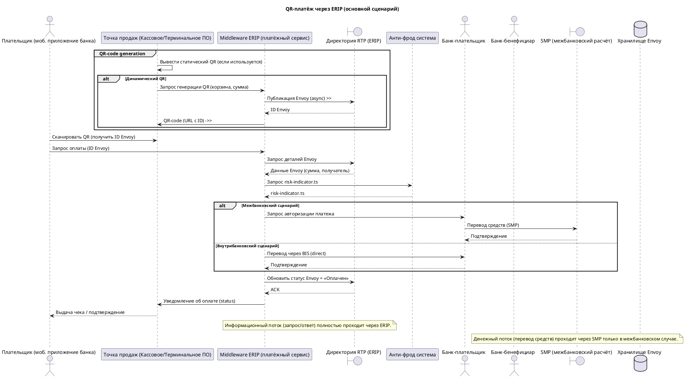

**Краткий анализ встречи**

1. Тема – разработка сервиса QR‑платежей, который будет использоваться в точках продаж банка‑бенефициара и взаимодействовать с внешней системой ERIP.  
2. Ключевые участники/системы – Плательщик (мобильное приложение банка), Точка продаж (кассовое/терминальное ПО), Сервис‑провайдер ERIP (внешний), Директория RTP, Система анти‑фрода, Межбанковская система расчётов SMP, Внутренний платежный сервис ERIP (middleware), База данных/хранилище запросов (Envoys).  
3. Описанный процесс – Плательщик сканирует QR‑код (статический или динамический), генерируется запрос Envoy через middleware‑ERIP, сохраняется в директории RTP, мобильное приложение банка инициирует оплату, банк‑плательщик запрашивает детали у RTP, анти‑фрод рассчитывает `risk‑indicator.ts`, ERIP возвращает статус, деньги переводятся через SMP (межбанковский сценарий) или напрямую через BIS (внутрибанковский), статус оплаты возвращается в ERIP и далее в точку продаж.  

---

**Допущения**

| № | Что уточнено/дополнено | Почему |
|---|------------------------|--------|
|1|`Envoy` – это объект платежного запроса, содержащий сумму, корзину и уникальный идентификатор. | В тексте упоминается «формируем Envoys». |
|2|Для статического QR‑кода QR генерируется заранее и хранится в терминале; для динамического – генерируется on‑demand через middleware‑ERIP. | Описаны два варианта QR. |
|3|`risk‑indicator.ts` рассчитывается внешней системой анти‑фрода и возвращается в виде отдельного сообщения. | В тексте сказано, что анти‑фрод будет доработан. |
|4|Система SMP используется только при межбанковском переводе; при внутрибанковском переводе используется BIS (direct settlement). | Указано разделение денежных и информационных потоков. |
|5|Все сообщения синхронные (`->`) за исключением публикации Envoy в директорию RTP, которое считается асинхронным (`->>`). | Типичный характер публикации в каталог. |
|6|Ответы от ERIP к банку‑плательщику и к точке продаж передаются через `-->` (пунктир). | Стандартный стиль ответа. |

---

**PlantUML‑диаграмма**

---

**Открытые вопросы**

1. **Точные API‑методы** – какие названия методов (HTTP/REST, SOAP) используются для публикации Envoy, получения статуса и расчёта `risk‑indicator.ts`?  
2. **Формат сообщений** – какие поля обязательны в объекте Envoy (например, `invoiceId`, `amount`, `currency`)?  
3. **Точки интеграции с кассовым ПО** – требуется ли отдельный вызов из кассы для получения QR‑кода или достаточно передачи URL от middleware?  
4. **Обработка возврата** – как выглядит сценарий возврата товара (какие сообщения и какие системы участвуют)?  
5. **Таймауты и повторные попытки** – какие требования к надёжности (retry, компенсационные транзакции) при взаимодействии с SMP и RTP?  

Уточнение этих деталей позволит уточнить подписи сообщений и добавить альтернативные сценарии (например, возврат, ошибка анти‑фрода) в диаграмму.