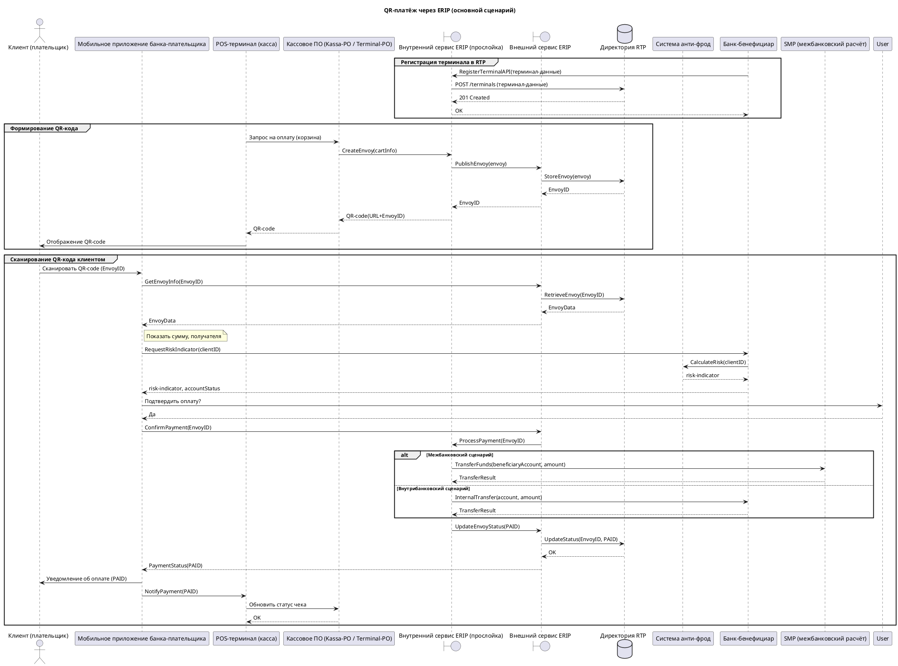

**Краткий анализ встречи**

1. Тема — внедрение QR‑платежей через сервис ERIP для клиентов банка‑бенефициара и банка‑плательщика, а также регистрация терминалов/клиентов в директории RTP.  
2. Участники — клиент (плательщик), мобильное приложение банка‑плательщика, POS‑терминал (касса), кассовое ПО (Kassa‑PO / Terminal‑PO), банковская система (банк‑бенефициар), сервис ERIP (внешний), внутренний сервис ERIP (прослойка банка), директория RTP, система анти‑фрод, система межбанковского расчёта SMP, база данных/хранилище.  
3. Описанный процесс — сканирование QR‑кода, запрос информации о платеже, проверка риска, подтверждение оплаты, перевод средств (информационный поток через ERIP, денежный — через SMP), уведомление о статусе оплаты. Также обсуждалась регистрация терминалов/клиентов в RTP через API.  

**Допущения**

| № | Что предположено | Почему |
|---|------------------|--------|
| 1 | Клиент сканирует QR‑код через мобильное приложение банка‑плательщика. | В тексте упоминается «мобильное приложение его банка». |
| 2 | Запрос на генерацию QR‑кода (динамический) отправляется от POS‑терминала в внутренний сервис ERIP, который публикует Envoy в директорию RTP. | Описана последовательность: «формируем Envoys и публикуем его в директории RTP». |
| 3 | При подтверждении оплаты мобильное приложение запрашивает статус Envoy у ERIP, который в свою очередь запрашивает у банка‑бенефициара риск‑индикатор и статус счета. | Описано, что ERIP «запрашивает у нас информацию дополнительную», включая risk‑indicator и статус счета. |
| 4 | Денежный перевод между банками проходит через SMP, если банки разные; при внутрибанковском сценарии – через BIS (внутренний процессинг). | Указано различие «межбанковская система … SMP» и «внутрибанковская – без SMP». |
| 5 | Регистрация терминала/клиента в RTP происходит через API‑метод, предоставляемый банком‑бенефициаром. | Уточнено: «регистрация … через API». |
| 6 | Все сообщения являются синхронными запрос‑ответ (→ / -->). | В тексте нет упоминаний о асинхронных колл‑бэках, поэтому использованы синхронные стрелки. |

**PlantUML‑диаграмма (основной сценарий оплаты QR‑кода)**

**Открытые вопросы**

1. **Какие именно API‑методы (имена, параметры) предоставляет банк‑бенефициар для регистрации терминалов/клиентов?**  
2. **Какой формат сообщения (JSON, XML) используется для Envoy и какие поля обязательны?**  
3. **Какие сценарии возврата (refund) планируются – нужен ли отдельный поток сообщений?**  
4. **Есть ли асинхронные колл‑бэки от ERIP (например, webhook) о статусе оплаты, или всё происходит синхронно?**  
5. **Какие ограничения/таймауты у взаимодействия с системой анти‑фрод (синхронный запрос или отдельный процесс)?**  
6. **Требуется ли логирование/хранение всех сообщений в отдельной базе данных (audit‑log) – какой компонент отвечает?**  

Уточнение этих пунктов позволит детализировать сообщения в диаграмме и добавить альтернативные сценарии (ошибки, возврат, таймауты).