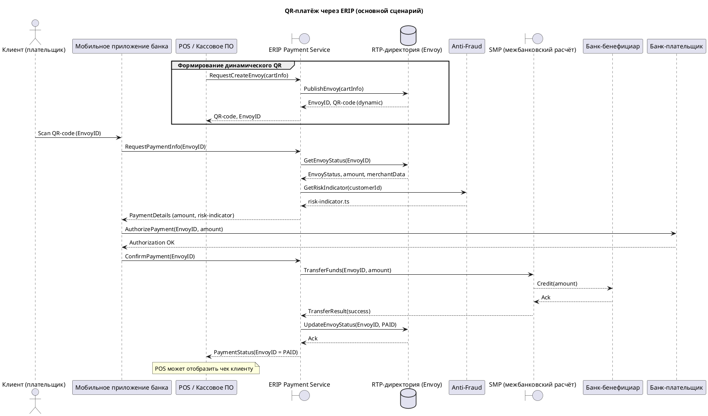

**Краткий анализ встречи**

1. Тема – проект интеграции QR‑платежей через сервис ERIP: регистрация терминалов, публикация Envoy (инвойса) в директорию RTP, сканирование QR‑кода клиентом и проведение оплаты.  
2. Ключевые участники / системы: клиент (плательщик), мобильное приложение банка, точка продаж (POS) / кассовое ПО, сервис‑прослойка **ERIP Payment Service**, директория **RTP**, система **Anti‑Fraud**, межбанковская система расчётов **SMP**, банк‑бенефициар и банк‑плательщик.  
3. Описанный процесс – 1) формирование и публикация инвойса в RTP, 2) сканирование QR‑кода клиентом, 3) запрос информации о платеже и проверка риска, 4) денежный перевод через SMP, 5) уведомление POS о статусе оплаты.  

**Допущения**

| № | Что уточнено/допущено |
|---|------------------------|
| 1 | **ERIP Payment Service** – это внутренний микросервис, который взаимодействует с внешним ERIP, RTP‑директорией и SMP. |
| 2 | **RTP** представлена как хранилище Envoy (инвойсов) и отвечает за публикацию/получение статуса. |
| 3 | **Anti‑Fraud** вызывается только при запросе информации о платеже (для получения `risk‑indicator.ts`). |
| 4 | Информационный поток (запрос/ответ) проходит полностью через **ERIP Payment Service**, а денежный – через **SMP**. |
| 5 | QR‑код может быть статическим (заранее размещён) / динамическим (генерируется после публикации Envoy). В диаграмме показан динамический вариант. |
| 6 | Регистрация терминалов происходит через API RTP, но детали регистрации (какой именно API) не указаны – обозначено как «RegisterTerminal API». |
| 7 | Последовательность действий выбрана в наиболее логичном порядке, исходя из описания (публикация → сканирование → проверка → перевод → уведомление). |

**PlantUML‑диаграмма**

**Открытые вопросы**

1. **Регистрация терминалов** – какие именно поля и формат API `RegisterTerminal` требуются?  
2. **Статический QR** – нужен ли отдельный сценарий, когда QR‑код заранее известен и публикация Envoy не происходит?  
3. **Anti‑Fraud** – какие данные передаются в запросе и какой ответ ожидается (формат `risk‑indicator.ts`)?  
4. **Схема взаимодействия с SMP** – используется ли отдельный протокол/сообщение для подтверждения перевода, или достаточно `TransferFunds`/`TransferResult`?  
5. **Обратный канал уведомления** – каким способом (push, polling) POS получает статус оплаты от ERIP PS?  

Уточнение этих пунктов позволит детализировать альтернативные сценарии и добавить технические детали (например, типы сообщений, коды ошибок).