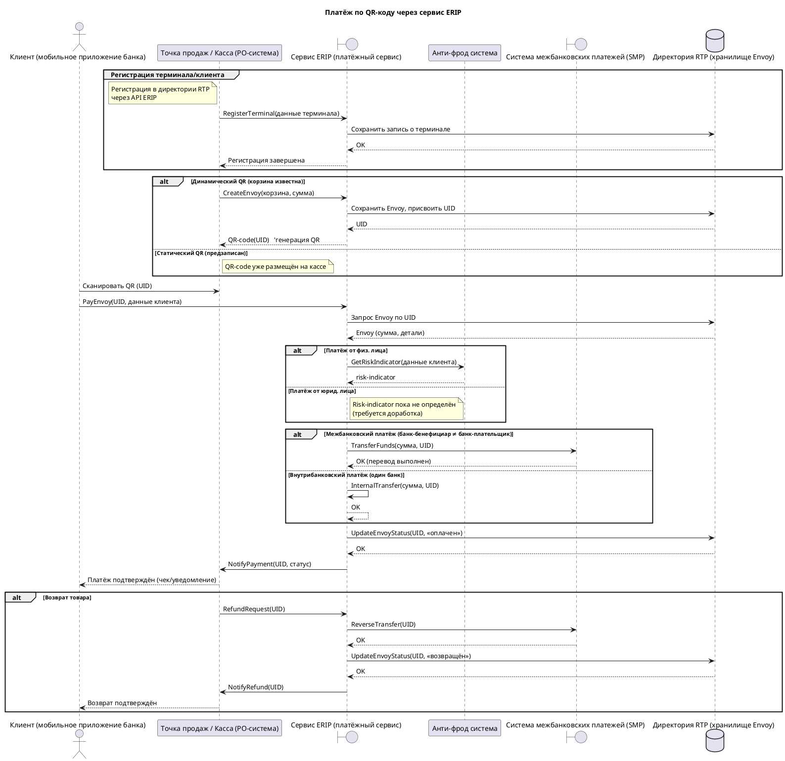

**Данных достаточно для построения sequence‑диаграммы.**  
Ниже – основная (основная) последовательность взаимодействий, а также альтернативные варианты (статический / динамический QR, внутрибанковский / межбанковский платёж).

---

### Что использовано из текста
| Компонент | Как упомянут в транскрипте |
|-----------|----------------------------|
| **Клиент (мобильное приложение банка)** | «клиент сканирует QR‑код через собственное мобильное приложение» |
| **Точка продаж / Касса (PO‑система)** | «касса/терминал», «белокасса», «PO‑система» |
| **Сервис ERIP** | «платёжный сервис ERIP», «прослойка для взаимодействия с внешней системой ERIP» |
| **Директория RTP** | «директория RTP», «хранит Envoy» |
| **Анти‑фрод система** | «расчёт risk‑indicator.ts», «анти‑фрод работает только с физ. лицами» |
| **Система межбанковских платежей (SMP)** | «денежный поток проходит через СМП» |
| **Регистрация терминалов/клиентов** | «регистрация клиентов/терминалов через API ERIP» |
| **Статический vs динамический QR** | «QR‑code может быть статическим или динамическим» |
| **Внутрибанковский vs межбанковский платёж** | «если банк‑бенефициар = банк‑плательщик → без SMP; иначе → через SMP» |
| **Возврат товара** | «есть вариант возврата, использует те же системы» |

### Допущения
* Точная названия API‑методов (например `CreateEnvoy`, `PayEnvoy`) выбраны условно, исходя из описания функций.
* Внутрибанковский перевод реализован как внутренний вызов внутри ERIP – в реальном решении может быть отдельный сервис.
* Для статического QR‑кода процесс создания Envoy пропускается – QR уже существует в POS.
* В случае юридических лиц риск‑индикатор пока не реализован (требуется доработка анти‑фрода).

Если нужны более детальные сообщения (например, конкретные названия методов, форматы запросов/ответов) или отдельные сценарии (например, только регистрация без оплаты), уточните эти детали – диаграмму можно уточнить.